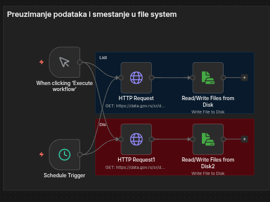
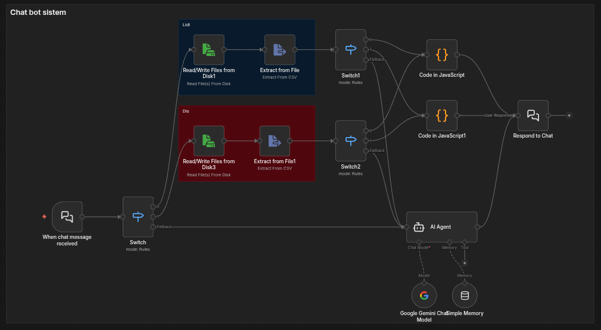
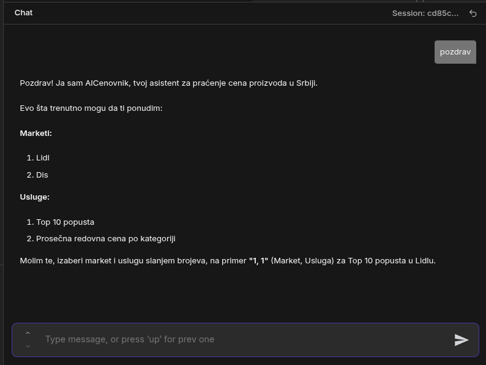

# n8n Price Analysis Automation

Automated workflow built in **n8n** for practice that downloads public product price lists for Serbian retailers, stores them locally, and lets users query insights through a chat-based interface.

## Screenshots





## Overview

This project implements a small RPA pipeline that:

- Fetches public CSV price lists for **Lidl** and **Dis**.
- Stores them on disk and keeps them up to date.
- Exposes a chat menu that lets users choose a store and an analysis.
- Returns results in a readable, human-friendly format.

## Features

- **Top 10 discounts** (highest percentage discount)
- **Average regular price by category**
- Manual run or scheduled refresh
- Chat-driven interaction (menu-based)

## Data sources

Public CSV datasets from data.gov.rs:

- Lidl: `https://data.gov.rs/sr/datasets/r/d2c3585c-aed7-4ce5-90a1-ea6eb96c47bc`
- Dis: `https://data.gov.rs/sr/datasets/r/844a28cb-9b83-441f-a524-76055b610b73`

## Tech stack

- n8n (workflow automation)
- HTTP Request node (download CSV)
- File System nodes (read/write on disk)
- Extract from File (CSV parsing)
- JavaScript Code nodes (analysis)
- AI Agent + Google Gemini (chat UX)

## Project structure

- `docker-compose.yml` - local n8n setup
- `My workflow.json` - n8n workflow export
- `local-files/` - mounted folder for CSV files
- `docs/Documentation.md` - detailed documentation (English)
- `docs/images/` - images extracted from original documentation

## Run locally

1. Start n8n:
   ```bash
   docker compose up -d
   ```
2. Open n8n at `http://localhost:5678`.
3. Import the workflow from `My workflow.json`.
4. Create Google Gemini credentials in n8n and connect them to the **Google Gemini Chat Model** node.
5. Execute the workflow manually or wait for the schedule trigger to refresh data.

## Chat usage

The bot expects a selection in the form `store, service`:

- `1, 1` = Lidl, Top 10 discounts
- `1, 2` = Lidl, Average regular price by category
- `2, 1` = Dis, Top 10 discounts
- `2, 2` = Dis, Average regular price by category

## Notes

- CSV files are written to `/files` inside the container and to `./local-files` on the host.
- The analysis uses Serbian CSV column names (e.g., `Redovna cena`, `Snižena cena`), so datasets must keep the same schema.

## License

MIT. See `LICENSE`.
